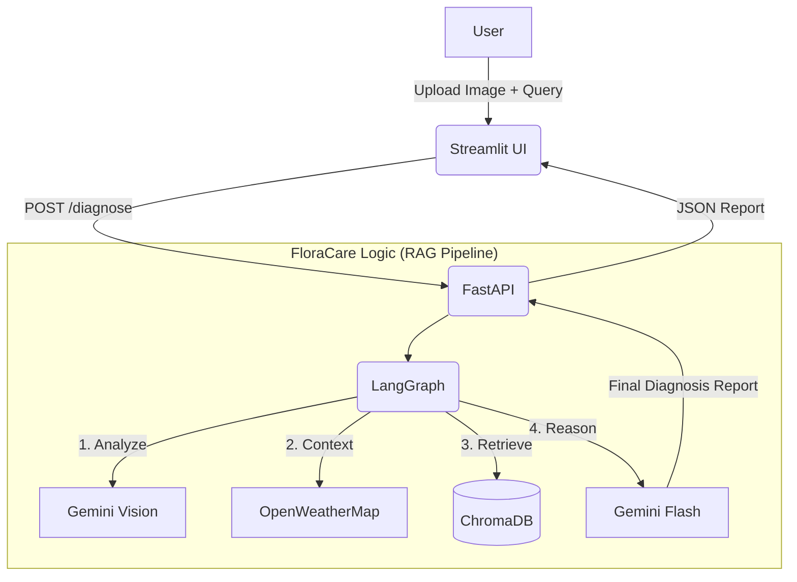

# FloraCare AI 🌿
**Intelligent Plant Diagnosis & Care Assistant**

FloraCare AI is a state-of-the-art, **stateless** plant diagnosis system powered by Google's Gemini LLM. It combines computer vision, retrieval-augmented generation (RAG), and real-time weather data to provide accurate, context-aware plant health assessments.

---

## 🚀 Key Features

*   **🔍 Visual Diagnosis:** Upload an image of any plant, and our Vision LLM (`gemini-2.5-flash`) detects the species, symptoms, and condition.
*   **🧠 RAG-Powered Knowledge:** Retrieval Augmented Generation queries a vector database (ChromaDB) of botanical knowledge to provide scientifically backed advice.
*   **🌍 Context Awareness:** Automatically integrates **local weather data** (Temperature, Humidity, Condition) via OpenWeatherMap to refine diagnoses (e.g., detecting heat stress vs. underwatering).
*   **💬 Interactive Q&A:**
    *   **Targeted Queries:** Ask specific questions upfront (e.g., "Is this safe for pets?") and get direct answers in the report.
    *   **Chat Assistant:** Have a follow-up conversation with an AI expert about the specific diagnosis results.
*   **🎙️ Voice Input:** Use your microphone to describe symptoms or ask questions naturally.
*   **🩺 Stateless Privacy:** No data is stored. Every refresh provides a clean slate. Your photos and queries are processed instantly and then discarded.

---

## 🛠️ Technology Stack

*   **Frontend:** [Streamlit](https://streamlit.io/) (Python-based UI)
*   **Backend:** [FastAPI](https://fastapi.tiangolo.com/) (High-performance API)
*   **AI Models:** [Google Gemini 2.5 Flash](https://deepmind.google/technologies/gemini/) (Vision & Reasoning)
*   **Vector Database:** [ChromaDB](https://www.trychroma.com/) (Knowledge Retrieval)
*   **Orchestration:** [LangGraph](https://python.langchain.com/docs/langgraph) (Workflow Management)
*   **External APIs:** [OpenWeatherMap](https://openweathermap.org/)

---

## 📦 Installation

### 1. clone the repository
```bash
git clone https://github.com/your-repo/FloraCare-Ai.git
cd FloraCare-Ai
```

### 2. Create a Virtual Environment
```bash
python3 -m venv .venv
source .venv/bin/activate
```

### 3. Install Dependencies
```bash
pip install -r requirements.txt
```

### 4. Setup Environment Variables
Create a `.env` file in the root directory:
```bash
GOOGLE_API_KEY="your_gemini_api_key"
OPENWEATHER_API_KEY="your_weather_api_key"
API_URL="http://localhost:8000"
```
python scripts/ingest_data.py data
---

## 🏃‍♂️ Usage

### Start the Backend Server
In one terminal, launch the FastAPI server:
```bash
uvicorn src.api.main:app --host 0.0.0.0 --port 8000 --reload
```
*   **Swagger API Docs:** `http://localhost:8000/docs`
*   **Health Check:** `http://localhost:8000/health`

### Start the Frontend UI
In a separate terminal, launch the Streamlit app:
```bash
streamlit run src/frontend/app.py
```
*   **Access the App:** `http://localhost:8501`

---

## 🏗️ Architecture



---

## 🧪 Testing

Run the test suite using pytest:
```bash
pytest
```

---

## 🔒 Security & Privacy
*   **Stateless by Design:** This application does not use a persistent database for user data. All uploaded images and session data are cleared when the session ends or the page is refreshed.
*   **API Keys:** Keys are managed via `.env` and are never exposed to the frontend client.

---
*Built with 💚 by the FloraCare AI Team*