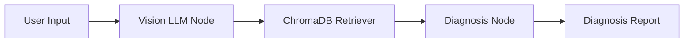

# FloraCare AI - Phase 1 Setup Specification

## 1. Overview
**Goal**: Establish the technical foundation for "FloraCare AI", an intelligent plant health diagnostic application.
**Scope**: Phase 1 covers environment setup, Vision-LLM integration, Botanical Knowledge Base (ChromaDB) construction, and a basic RAG pipeline.

## 2. System Architecture
The system follows a modular pipeline architecture orchestrated by **LangGraph**.

### 2.1 High-Level Flow
1.  **Input**: User uploads an image of a plant.
2.  **Vision Analysis**: Gemini 1.5 Flash analyzes the image for symptoms (e.g., "yellow spots on leaves").
3.  **Context Retrieval**: The system queries ChromaDB for relevant botanical knowledge based on visual symptoms.
4.  **Diagnosis**: The LLM synthesizes the visual analysis and retrieved context to provide a diagnosis and treatment plan.
5.  **Output**: A structured JSON report (and readable text) is returned to the user.

### 2.2 Component Diagram

## 3. Technical Implementation

### 3.1 Tech Stack
*   **Language**: Python 3.12+
*   **Orchestration**: LangGraph
*   **LLM**: Google Generative AI (Gemini 1.5 Flash)
*   **Vector Database**: ChromaDB (Local Persistence)
*   **Validation**: Pydantic v2

### 3.2 Directory Structure
(As defined in Implementation Plan)
*   `src/models`: Shared Pydantic schemas.
*   `src/llm`: Wrappers for Gemini API.
*   `src/vector_store`: ChromaDB vector store management.
*   `src/rag`: LangGraph nodes and workflows.

### 3.3 Data Models (Strict Contract)

#### `src/models/schemas.py`
These models serve as the single source of truth for component interfaces.

**`PlantImageAnalysis`**
*   `plant_type` (str): Identified plant.
*   `visual_symptoms` (List[str]): Extracted visual features.
*   `description` (str): Raw visual description.
*   `confidence` (float): Confidence score.

**`DiagnosisReport`**
*   `analysis` (PlantImageAnalysis): The upstream visual analysis.
*   `diagnosis` (str): Final conclusion.
*   `treatment_plan` (List[str]): Actionable steps.
*   `citations` (List[str]): References to KB chunks.

### 3.4 Key Components

#### `src/llm/gemini_client.py`
*   **Class**: `GeminiClient`
*   **Method**: `analyze_image(image_path: str) -> PlantImageAnalysis`
    *   Uses `response_schema` feature of Gemini 1.5 to guarantee JSON output matching the Pydantic model.

#### `src/vector_store/chroma_store.py`
*   **Class**: `BotanicalKnowledgeBase`
*   **Method**: `add_documents(documents: List[str], metadatas: List[dict])`
*   **Method**: `query(query_text: str, n_results: int=3) -> List[KnowledgeChunk]`

#### `src/rag/pipeline.py`
*   **StateGraph**: Defines the nodes `analyze_image`, `retrieve_context`, `generate_diagnosis`.
*   **State**: `DiagnosisState` (TypedDict) keeping track of the image path, analysis result, retrieved docs, and final report.

## 4. Verification & Quality Assurance
*   **Linting**: `ruff` for linting and formatting. `mypy` for static type checking.
*   **Testing**: `pytest` suite.
    *   `tests/fast/`: Mocked unit tests for logic.
    *   `tests/slow/`: Integration tests hitting real APIs.
